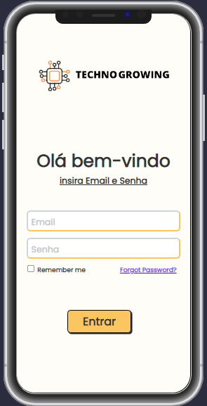

<h1>login responsivo</h1>
<h2>Projeto feito com  
 
 
 

  <a href="https://erikcosta-o.github.io/Login-Projeto-v1.0/"><h4 align="center">Link para ver projeto</h4></a>

<h4 align="center">
extenção <a href="https://marketplace.visualstudio.com/items?itemName=cirlorm.mobileview">MobileView</a>

 <h2>Obs:<h3>Logo TECNHO GROWING faz parte de um projeto integrador (PI).</h3></h2>
 
